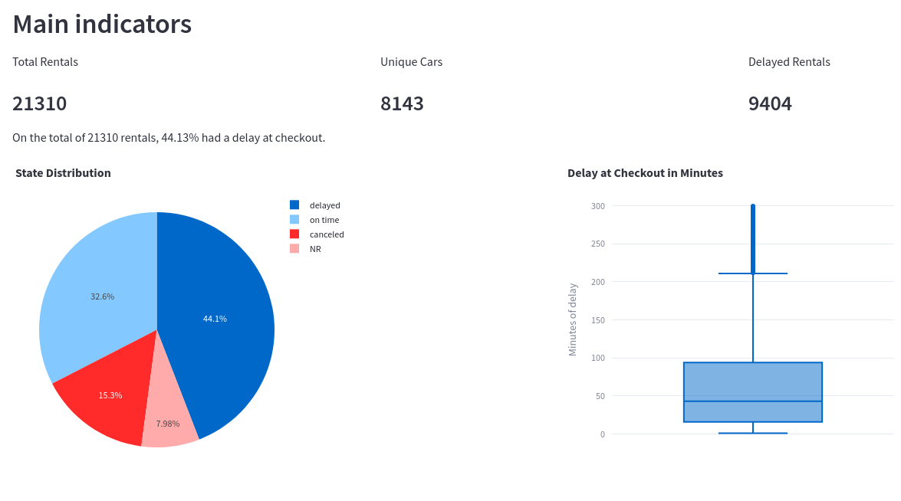
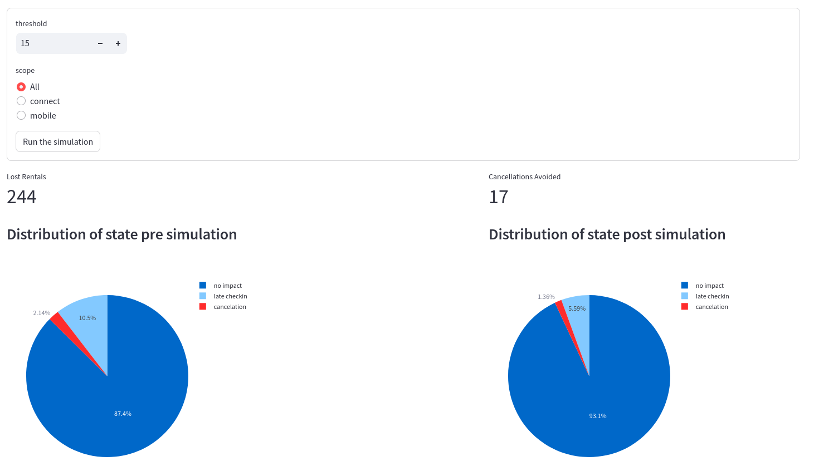
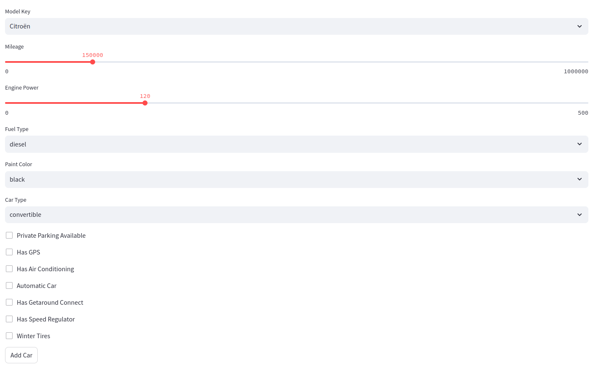

# Getaround Analysis

This project was developed as part of a school assignment focused on the deployment aspect of data science. It involves two main components: an analysis on late checkouts and their impacts, and a machine learning model to infer vehicle rental prices based on given information.

## Table of Contents

- [Description](#description)
- [Repo Architecture](#repo-architecture)
- [Installation](#installation)
- [Uninstall](#uninstall)
- [Usage](#usage)
- [Contributing](#contributing)
- [Enhancements](#enhancements)
- [Contact Information](#contact-information)

## Description

### Analysis of Late Checkouts on Getaround

- **Overview**: Getaround is a rental car service where late checkouts can pose significant operational challenges.
- **Goal**: The analysis aims to identify the impacts of late checkouts on consecutive rentals.
- **Implementation**: This component is implemented using a Streamlit app, providing an interactive and visual interface for data exploration and insights.

### Vehicle Price Prediction Model

- **Goal**: To build a predictive model to estimate car rental prices based on vehicle details.
- **Technology**: The model is built using XGBoost, a powerful and efficient implementation of the gradient boosting framework.
- **Deployment**: The model is served via an API using FastAPI, a modern, fast, high-performance web framework for building APIs with Python.
- **Model Management**: Model versioning and storage are managed with MLflow, ensuring reproducibility and easy deployment.

## Repo Architecture
```
.
├── api
│ ├── api.py            <-- API endpoint definition
│ ├── Dockerfile
│ ├── get_around_pricing_project.csv
│ ├── model.py          <-- Model class
│ ├── param.py          <-- API docs
│ └── requirements.txt
├── data
│ ├── get_around_delay_analysis.xlsx
│ └── get_around_pricing_project.csv
├── front
│ ├── app.py            <-- Main script for Streamlit front
│ ├── Dockerfile
│ ├── get_around_delay_analysis.xlsx
│ ├── get_around_pricing_project.csv
│ ├── requirements.txt
│ └── utils.py          <-- Utility function for the main script
├── mlflow
│ ├── Dockerfile
│ └── requirements.txt
├── notebook
│ ├── 01-Getaround_analysis.ipynb
│ ├── exploration.ipynb
│ └── ml.ipynb
├── push_heroku.sh      <-- Bash script to push all apps to Heroku
├── delete_heroku.sh    <-- Bash script to destroy all apps from Heroku
├── docker-compose.yaml <-- Docker compose file for local dev
└── README.md
```

## Installation

Step-by-step instructions on how to get a development environment running.

### Requirements

- Python 3.10+
- Docker
- Heroku CLI: [Heroku CLI Installation Guide](https://devcenter.heroku.com/articles/heroku-cli)
- Docker compose for local development

### Steps

1. Clone the repository:
    ```bash
    git clone https://github.com/GrGLeo/projet_deployment.git
    ```

2. Navigate to the project directory:
    ```bash
    cd projet_deploymeny
    ```

3. Copy the template environment file:
    ```bash
    cp template.env .env
    ```

4. Fill in the `.env` file with the following variables:
    - `AWS_ACCESS_ID`
    - `AWS_ACCESS_KEY`
    - `S3_BUCKET`

5. Push everything to Heroku:
    ```bash
    chmod +x push_heroku.sh
    ./push_heroku.sh
    # Follow the given link to access the front app
    ```
6. Docker compose for local development, is in WIP state, not yet functionnal
    ```bash
    docker compose up --build
    ```

## Uninstall
If the Heroku apps aren't needed anymore, destroy all apps by running:
```bash
chmod +x delete_heroku.sh
./delete_heroku.sh
```

## Usage

The frontend provides three main pages:

1. **Analysis of Late Checkouts**: 
   - Provides insights into the Getaround data and the effects of late checkouts on subsequent rentals.  
    
2. **Simulation Page**:
   - Allows users to run simulations and suggest buffer windows between rentals to mitigate the impact of late checkouts.  
    
3. **Price Prediction**:
   - A form where users can input vehicle details to get a predicted rental price per day from the model.  
    

## Contributing

Guidelines for contributing to the project:

1. Fork the repository.
2. Create a new branch (`git checkout -b feature/your-feature`).
3. Make your changes.
4. Commit your changes (`git commit -m 'Add some feature'`).
5. Push to the branch (`git push origin feature/your-feature`).
6. Open a pull request.

## Enhancements

### Backend

- [ ] Store data files in an S3 Bucket to avoid copying CSV or XLSX files to each container.
- [ ] Manage S3 Bucket interactions through a Python module.

### Frontend

- [ ] Rework the second page for better overview and clarity.
- [ ] Improve form interactions for smooth navigation.
- [x] Enhance caching for better performance.

### Miscellaneous

- [ ] Clean the codebase.
- [ ] Fix docker compose network for local run

## Contact Information

- **GitHub**: [GrGLeo](https://github.com/GrGLeo)
